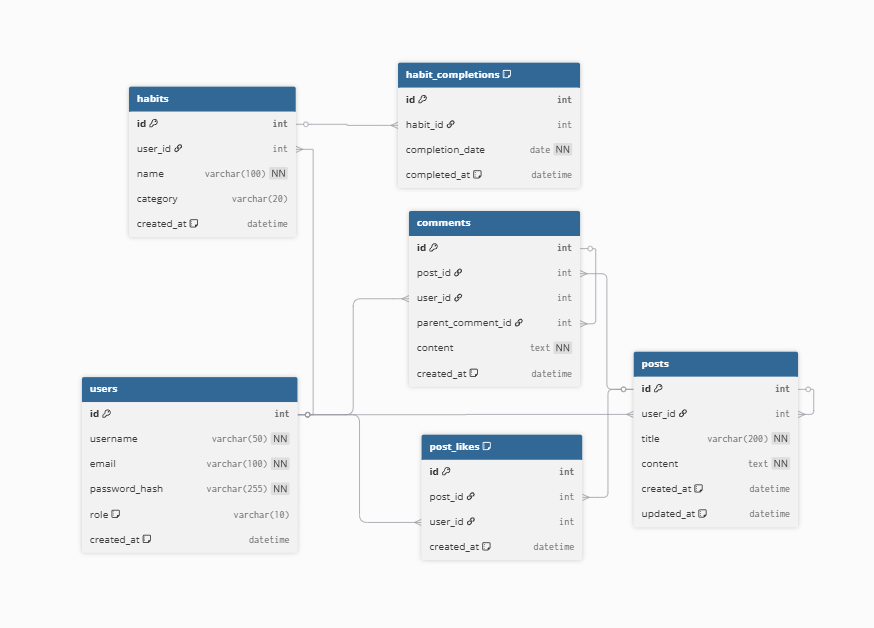
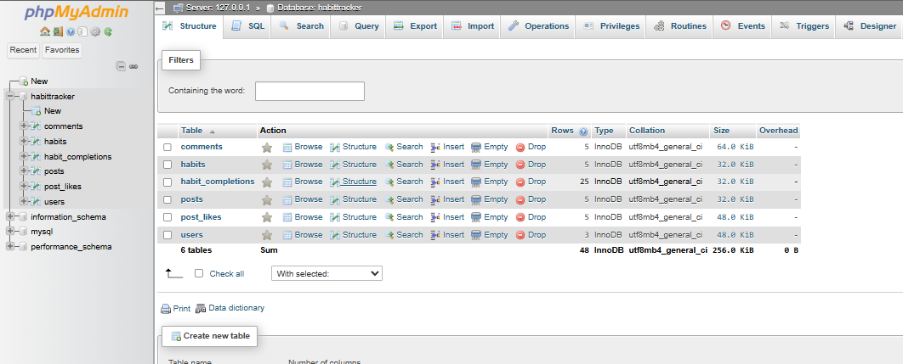
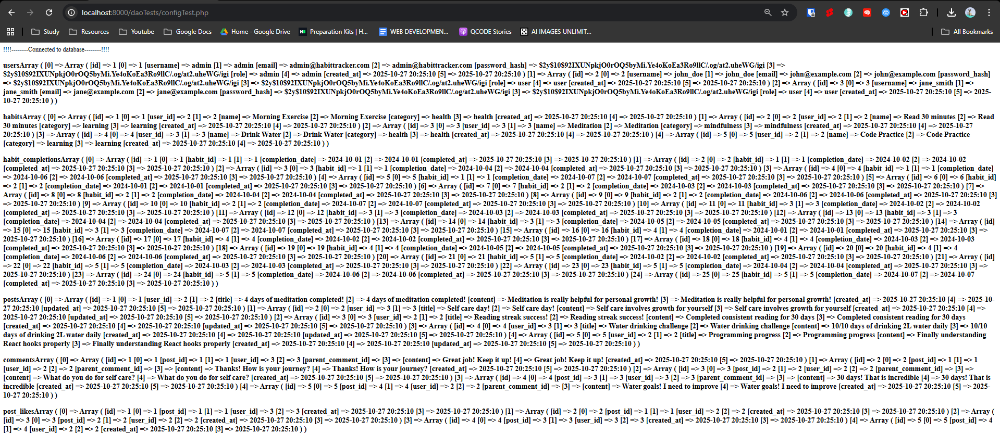

# 1. HabitTracker - Milestone 1 Completion

## Milestone 1: Static Frontend Development

### 1. Project Structure (1pt)

Backend Structure

- backend
- routes
- services
- dao
- config

Frontend Structure
Assets

- css
- - spapp.css # SPA routing styles
- - custom.css
- js
- - custom.js # Application initialization
- img
- - DB.png
- - check-mark.png
- Views
- - home.html
- - habits.html
- - community.html
- - login.html
- - register.html
- - profile.html
- - about.html
- - admin.html
- index.html # Main SPA container

### 2. Static Frontend (3pts)

- **home.html** -> Landing Page
- **habits.html** -> Habit Creation and Tracking page
- **community.html** -> Communication with other Individuals
- **login.html** -> Account managmenet
- **register.html** -> Account Creatiom
- **profile.html** -> User Account Managment
- **about.html** -> About the Site
- **admin.html** -> Admin Control Dashboard
- **index.html** -> Main SPA Container with Footer and Header

### 3. Database Schema (Planning Only) (1pt)

- **6 Enteties (users, habits, habit completions, posts, comments, post likes)**

milestone 1 branch

# 2. HabitTracker - Milestone 2 Completion

## Milestone 2: Backend Setup and CRUD Operations

### 1. Database (1pt)

Link: http://localhost/phpmyadmin

**✅ Database Schema Implemented:**

### 2. DAO Layer Implementation (4pts)

Steps: Go to php -S localhost:8000, in tab o http://localhost:8000/daoTests/configTest.php and there should be everything in working order
