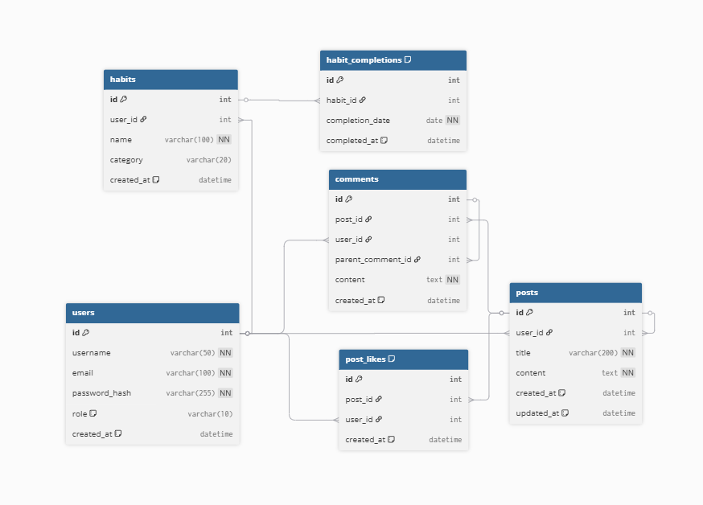
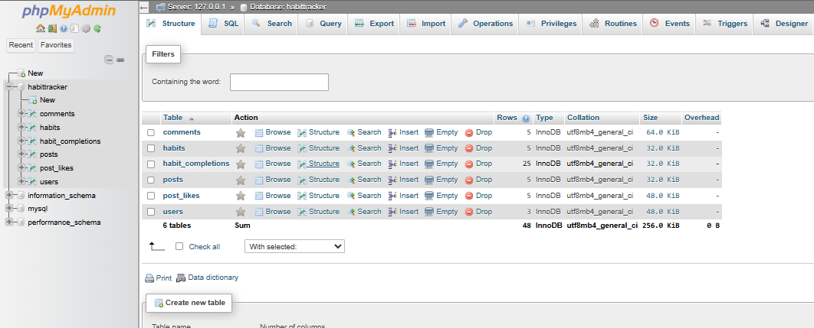
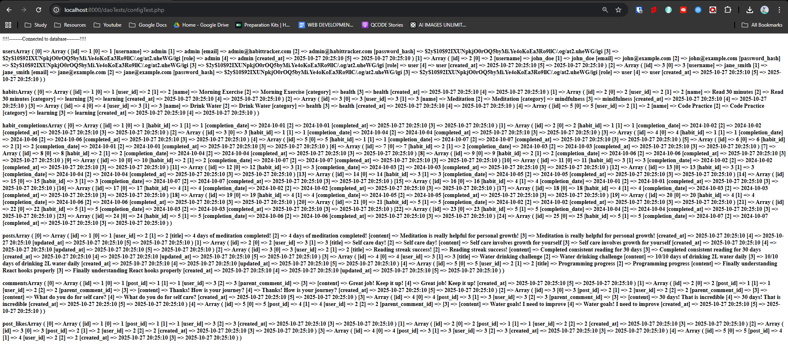

# 5. HabitTracker - Milestone 5: Deployment

<h1 align="center" style="font-size: 2.5em; margin: 50px 0;">
  <a href="https://habittracker.yzz.me" style="color: #007bff; text-decoration: none;">
     habittracker.yzz.me
  </a>
</h1>

## If for some reason there are issues do to the Service provider please try through incognito mode or disabling the cookies

# 1. HabitTracker - Milestone 1 Completion

## Milestone 1: Static Frontend Development

### 1. Project Structure (1pt)

Backend Structure

- backend
- routes
- services
- dao
- config

Frontend Structure
Assets

- css
- - spapp.css # SPA routing styles
- - custom.css
- js
- - custom.js # Application initialization
- img
- - DB.png
- - check-mark.png
- Views
- - home.html
- - habits.html
- - community.html
- - login.html
- - register.html
- - profile.html
- - about.html
- - admin.html
- index.html # Main SPA container

### 2. Static Frontend (3pts)

- **home.html** -> Landing Page
- **habits.html** -> Habit Creation and Tracking page
- **community.html** -> Communication with other Individuals
- **login.html** -> Account managmenet
- **register.html** -> Account Creatiom
- **profile.html** -> User Account Managment
- **about.html** -> About the Site
- **admin.html** -> Admin Control Dashboard
- **index.html** -> Main SPA Container with Footer and Header

### 3. Database Schema (Planning Only) (1pt)

- **6 Enteties (users, habits, habit completions, posts, comments, post likes)**

milestone 1 branch

# 2. HabitTracker - Milestone 2 Completion

## Milestone 2: Backend Setup and CRUD Operations

### 1. Database (1pt)

Link: http://localhost/phpmyadmin

**✅ Database Schema Implemented:**

### 2. DAO Layer Implementation (4pts)

Steps: Go to php -S localhost:8000, in tab o http://localhost:8000/daoTests/configTest.php and there should be everything in working order

# HabitTracker - Milestone 3 Completion

## Milestone 3: Full CRUD Implementation & OpenAPI Documentation

### 1. Business Logic Implementation (2pts) ✅

**Services Layer with Business Logic:**

- **BaseService.php** - Core service functionality
- **UserService.php** - User registration with email validation and password hashing
- **HabitService.php** - Habit creation with validation and default category assignment
- **HabitCompletionService.php** - Prevents duplicate completions on same date
- **PostService.php** - Post validation with title length limits
- **PostLikeService.php** - Toggle like/unlike functionality
- **CommentService.php** - Comment validation and nested replies support

**Key Business Rules Implemented:**

- Email and username uniqueness validation
- Password hashing for security
- Prevention of duplicate habit completions
- Content length validation
- Automatic timestamp management

### 2. Presentation Layer (1pt) ✅

**FlightPHP Micro-framework Implementation:**

### 3. OpenAPI Documentation (2pts) ✅

**Swagger Integration:**

NOTE: Run php -S localhost:8000, In XAMP Turn on (Appache and MySQL)

API Base URL: http://localhost/habittracker/Backend/

Swagger Documentation: http://localhost/habittracker/Backend/public/v1/docs/

# 2. HabitTracker - Milestone 4 Completion

## Milestone 4: Middleware, Authentication, and Authorization

### 1. Authentication and Middleware (1pt) ✅

AuthMiddleware.php - JWT token verification and validation

Roles.php - Roles for users and admin

AuthService.php - Secure authentication (JWT Generation with 24H Validation, Email and Username validation)

Token Reading Issue Fix

### 2. Authentication and Middleware (1pt) ✅

Role Based Access Control

### 3. Frontend Updates (3pts) ✅

## base-service.js

## habit-service.js - Users can create, edit, delete habits

## post-service.js Users can create, edit, delete comments or posts

## profile-service.js Users can see theyre profiles (Username, email)

## admin-service.js Admins can do what ever everyone else can

## http://localhost/habittracker/Backend -> The Backend

## Tests with Postman:

